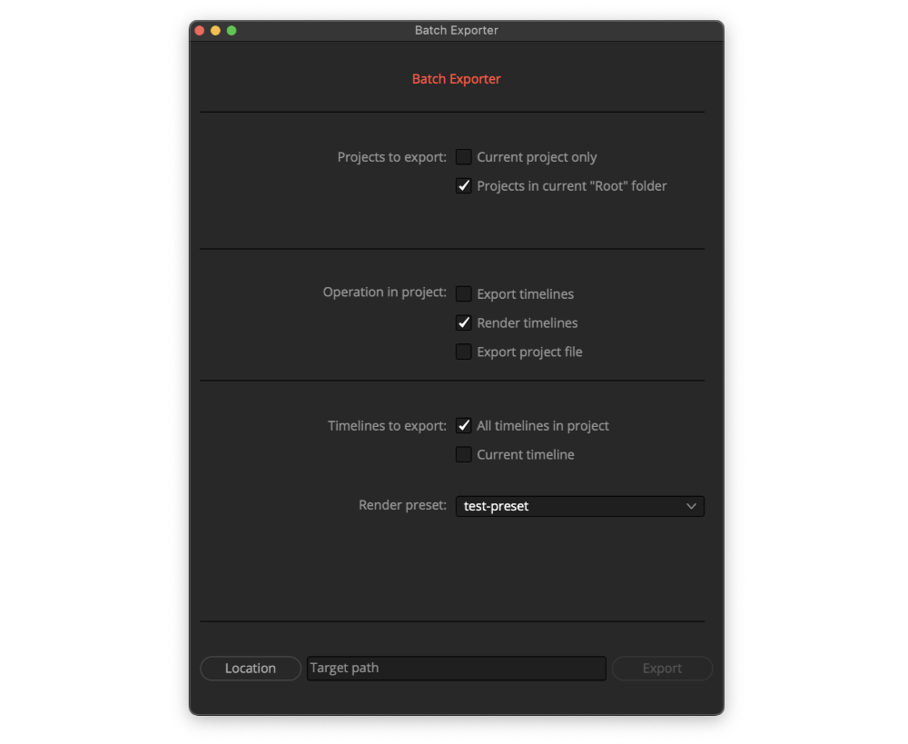

[中文](README.md) | English

# Intro
Batch export/render timelines/projects in DaVinci Resolve.

# Installation

- Please move *Batch_export.py* to Resolve script folder:
  - macOS: /Users/{USER}/Library/Application Support/Blackmagic Design/DaVinci Resolve/Fusion/Scripts/Edit
  - Windows: C:\Users\{USER}\AppData\Roaming\Blackmagic Design\DaVinci Resolve\Support\Fusion\Scripts\Edit

- then you can find scripts in menu under *Workspace* > *Scripts*.
- Note that the script only runs inside Resolve.

# Usage

Select what you want to export or render:

- Export projects in the same folder of *project manager* (.drp)
  - To prevent the export process takes too long, projects in subfolders are not included.
- Export each timeline in the project to the specified location in the following formats: .drt / .xml / .edl / .aaf / .csv / .txt.
  - This function is similar to the menu option: File > Export > Timeline...
- Add a render job to the render queue for each timeline in *current project* with the specified *render preset*.
- BTW, *multiple projects x multiple timelines* are also supported.

# Requirements

- DaVinci Resolve 17 or higher version.
- Python 3.6 64-bit.
- Higher versions of Python are not supported before DaVinci Resolve 18.
- No additional third-party libraries are required.

# Support our projects:

